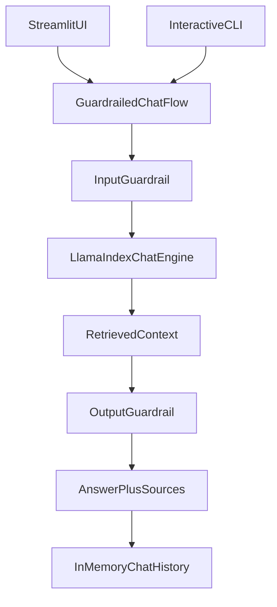

# Chat Engine Migration Plan

## Goal

Replace the current retrieval+synthesis `QueryPipeline` with a LlamaIndex `chat_engine` so follow-up questions can use prior conversation context in both the Streamlit UI and the CLI.

## Current State

The current app is single-turn even though the UI displays prior messages:

```172:179:/Users/peabody/Documents/repos/library_bot_poc/library_bot_poc/src/query.py
def build_query_engine(*, database_url: str | None = None, similarity_top_k: int = SIMILARITY_TOP_K) -> Any:
    configure_llamaindex(enable_llm=True)
    index = load_vector_index(database_url=database_url)
    return QueryPipeline(
        retriever=index.as_retriever(similarity_top_k=similarity_top_k),
        response_synthesizer=get_response_synthesizer(response_mode=ResponseMode.COMPACT),
    )
```

```96:104:/Users/peabody/Documents/repos/library_bot_poc/library_bot_poc/streamlit_app.py
if prompt := st.chat_input("Ask about the indexed content"):
    st.session_state.messages.append({"role": "user", "content": prompt, "sources": []})
    ...
    result = run_guardrailed_query(prompt, query_pipeline=query_pipeline)
```

LlamaIndex chat history is documented on the chat-engine path, not the plain query-engine path: [Chat Engine docs](https://docs.llamaindex.ai/en/stable/module_guides/deploying/chat_engines/) and [Usage Pattern](https://docs.llamaindex.ai/en/stable/module_guides/deploying/chat_engines/usage_pattern/).

## Proposed Design




## Implementation Steps

### 1. Introduce a shared chat-engine builder in [src/query.py](/Users/peabody/Documents/repos/library_bot_poc/library_bot_poc/src/query.py)

Create a new shared builder such as `build_chat_engine(...)` using `index.as_chat_engine(...)` instead of manually wiring `retriever + response_synthesizer`.

Plan for this file:

- keep `normalize_query_text()` and source-extraction helpers if they remain reusable
- replace or deprecate `QueryPipeline`
- add a new chat-oriented wrapper type if needed to hold both the LlamaIndex chat engine and any extra metadata needed for source extraction
- choose an explicit chat mode rather than relying on an implicit default; `condense_question` or `condense_plus_context` are the main candidates because they are designed for follow-up questions over retrieved data

### 2. Refactor the shared guardrails orchestration in [src/guardrails.py](/Users/peabody/Documents/repos/library_bot_poc/library_bot_poc/src/guardrails.py)

Update the guardrailed flow so it wraps a chat turn instead of a one-shot query.

Concretely:

- keep input guardrails on the raw user message before it reaches the chat engine
- invoke `chat_engine.chat(...)` for approved input instead of `retrieve_nodes(...)` plus `synthesize_response(...)`
- apply output guardrails to the returned assistant text
- preserve the existing `GuardrailedQueryResult` shape or rename it to reflect chat behavior

Important compatibility item:

- today the retrieval-stage guardrail logic depends on inspecting raw retrieved nodes before synthesis; if the move to `chat_engine` hides that step, decide whether to:
  - keep a custom retrieval path and feed results into a lower-level chat flow, or
  - temporarily narrow retrieval guardrails to post-response source inspection until a better hook is added

### 3. Make Streamlit use a persistent chat engine in [streamlit_app.py](/Users/peabody/Documents/repos/library_bot_poc/library_bot_poc/streamlit_app.py)

The UI already stores visible message history in `st.session_state.messages`, but it does not currently feed that history into LlamaIndex.

Update the plan for this file:

- cache or session-store a single chat engine instance per user session
- keep rendering `st.session_state.messages` for the transcript
- route each new prompt through the shared guardrailed chat function
- add a clear reset path so users can start a fresh conversation and the underlying LlamaIndex chat history resets too

### 4. Replace the CLI one-shot mode with an interactive chat loop in [src/query.py](/Users/peabody/Documents/repos/library_bot_poc/library_bot_poc/src/query.py)

Because you chose option C, the current `QUERY_TEXT`-only one-shot CLI should be replaced with a chat-style terminal flow.

Planned behavior:

- initialize one chat engine per CLI session
- repeatedly prompt for user input until an exit command such as `exit` or `quit`
- pass each turn through the same guardrailed chat function used by Streamlit
- print the assistant response and optionally the retrieved sources after each turn
- either retire `QUERY_TEXT` entirely or keep it only as an optional first-turn bootstrap for scripting; if kept, document clearly that the CLI is now interactive

### 5. Update tests around multi-turn behavior

Add or refactor tests so they prove history is actually used.

Target areas:

- [tests/test_query.py](/Users/peabody/Documents/repos/library_bot_poc/library_bot_poc/tests/test_query.py): add multi-turn tests where a follow-up question depends on a prior turn
- [tests/test_guardrails.py](/Users/peabody/Documents/repos/library_bot_poc/library_bot_poc/tests/test_guardrails.py): verify guardrails still apply on each chat turn and that blocked turns do not poison later chat history
- Streamlit-focused tests if present, or at minimum unit tests around any new session/history reset helper

Good regression examples:

- ask a first question that establishes a subject, then ask a follow-up like `What about on Sundays?`
- ensure a blocked prompt does not become part of retained assistant/user history

### 6. Update docs and runtime expectations

Revise the user-facing docs to match the new chat behavior:

- [README.md](/Users/peabody/Documents/repos/library_bot_poc/library_bot_poc/README.md)
- [.env.example](/Users/peabody/Documents/repos/library_bot_poc/library_bot_poc/.env.example) if `QUERY_TEXT` changes or is removed

Document:

- Streamlit and CLI now support conversational follow-ups
- how to reset chat state in each interface
- whether `QUERY_TEXT` still exists, and if so, what limited role it plays

## Key Risks

- The current retrieval guardrail step is implemented before synthesis in [src/guardrails.py](/Users/peabody/Documents/repos/library_bot_poc/library_bot_poc/src/guardrails.py). A direct `chat_engine` swap may remove easy access to raw retrieved nodes.
- Source extraction may change depending on what the chosen LlamaIndex chat engine returns on `.chat(...)` responses.
- CLI behavior will no longer be a simple shell one-liner unless a compatibility mode is intentionally preserved.

## Suggested Defaults

- Use a dedicated `build_chat_engine(...)` helper in [src/query.py](/Users/peabody/Documents/repos/library_bot_poc/library_bot_poc/src/query.py)
- Prefer a retrieval-aware chat mode such as `condense_question` or `condense_plus_context`
- Keep Streamlit history in both `st.session_state.messages` and the underlying LlamaIndex chat engine
- Replace the CLI with an interactive REPL-style loop and support `quit` / `exit` / `reset`
- Preserve the existing answer-plus-sources result shape so UI rendering changes stay minimal

